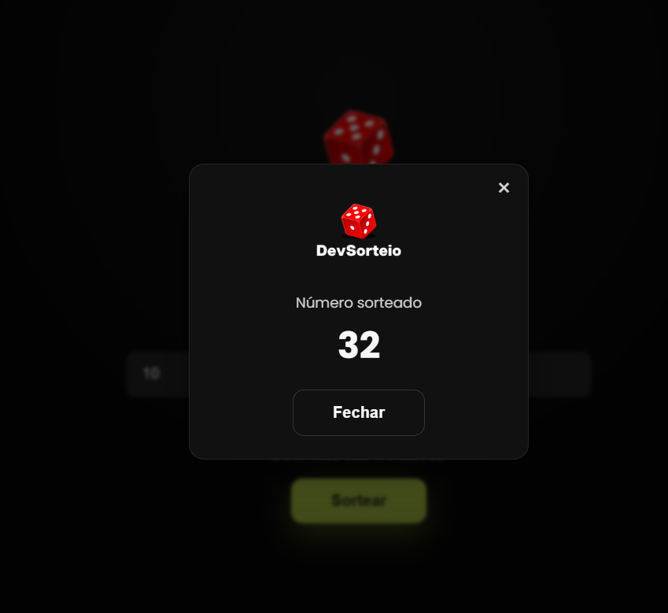
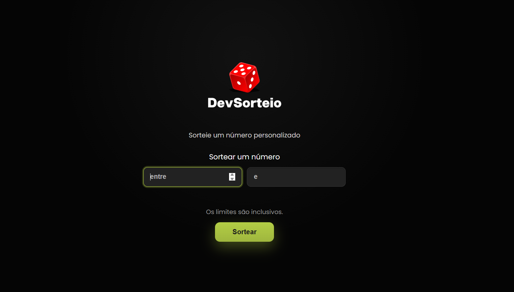
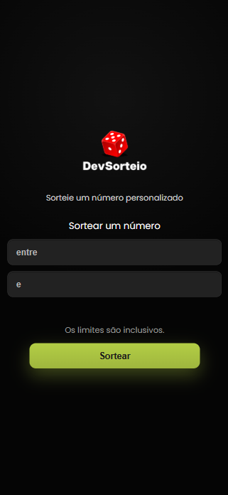

# DevSorteio

Aplicação web simples para sortear números dentro de um intervalo definido pelo usuário. Inspirada no layout fornecido e pronta para desktop e mobile.

## Recursos
- Intervalo configurável (limite mínimo e máximo inclusivos)
- Validação rápida com mensagens de erro amigáveis
- Resultado em pop-up, com fechamento por botão, overlay ou tecla `Esc`
- Layout responsivo e focado em acessibilidade (labels ocultos, `aria-live` para erros, foco ao abrir/fechar pop-up)

## Como usar
1. Abra `index.html` no navegador.
2. Informe os valores mínimo e máximo.
3. Clique em **Sortear** para ver o número sorteado no pop-up.

## Estrutura
- `index.html` – marcação principal do app.
- `style.css` – estilos e responsividade.
- `script.js` – lógica de validação, sorteio e controle do pop-up.
- `assets/dado1.png` – ícone do dado usado na interface.
- `assets/Sorteio-desk-sorteio.png`, `assets/Sorteio-desk.png`, `assets/Sorteio-mobile.png` – prévias do layout.
- Favicon: `assets/dado1.png` referenciado no `index.html`.

## Pré-visualizações
Desktop (variações) e mobile:

## Teste online
Abra em: https://digitaleducacao.com.br/sorteio/

## Notas de desenvolvimento
- O sorteio usa `Math.random()` para gerar um inteiro inclusivo entre os limites informados.
- O botão recebe estados de foco/hover e o pop-up preserva o foco ao ser fechado.
- Fonte preferencial: Poppins (via Google Fonts); fallback para fontes do sistema caso a fonte remota não esteja disponível.
